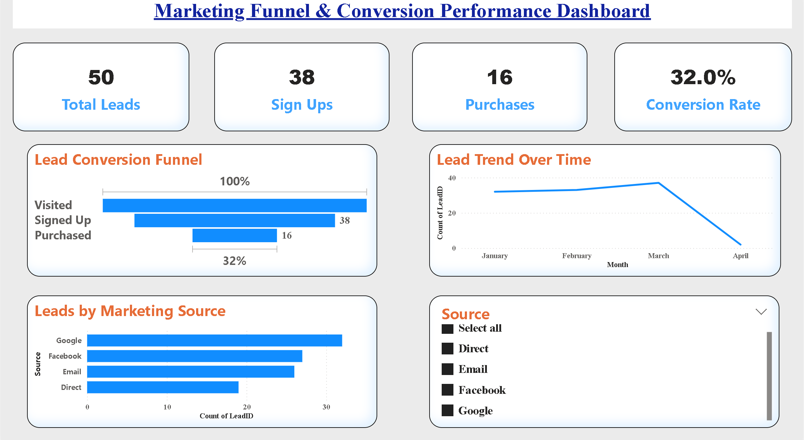

# FUTURE_DS_03
Marketing Funnel &amp; Conversion Dashboard built using Power BI to analyze lead journey from visit to purchase. Includes KPIs like total leads, sign-ups, purchases, and conversion rate, with insights on funnel drop-offs and channel performance.

## Task 3: Marketing Funnel & Conversion Analysis  
This project showcases a Marketing Funnel & Conversion Performance Dashboard developed as part of my internship Task 3. The dashboard provides insights into lead conversion, funnel drop-offs, and marketing channel performance using interactive visualizations.

🔹 Key Features:
KPI cards displaying Total Leads, Sign Ups, Purchases, and Conversion Rate  
Lead conversion funnel (Visited → Signed Up → Purchased)  
Monthly lead trend analysis to track performance over time  
Marketing source-wise lead distribution analysis  
Identification of conversion drop-offs at each stage  
Interactive slicer for dynamic filtering by source  

🛠 Tools & Technologies:
Power BI  
Microsoft Excel  

📌 Dataset:
The dataset contains marketing funnel data including Lead ID, Source (Facebook, Google, Email, Direct), Stage (Visited, Signed Up, Purchased), and Date.

📊 Insights Gained:
Identified major drop-off from Sign Up to Purchase stage  
Analyzed top-performing marketing channels  
Evaluated overall conversion rate (~32%)  
Provided recommendations to improve conversion efficiency  

## 📷 Dashboard Preview:

📁 Files Included:
Marketing_Funnel.pbix  
marketing_funnel_dataset.xlsx  
dashboard.png  

🎯 Conclusion:
This dashboard helps in understanding the customer journey through the marketing funnel and supports data-driven strategies to improve conversion rates and optimize marketing performance.
